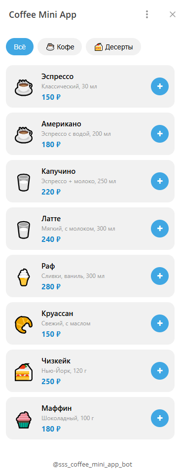
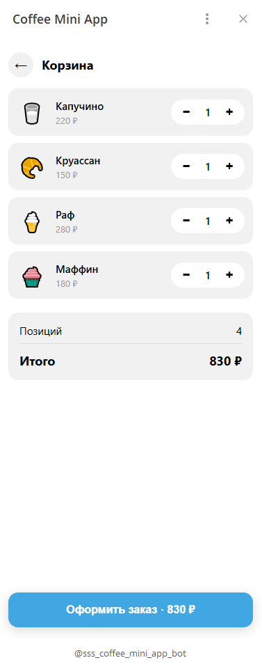
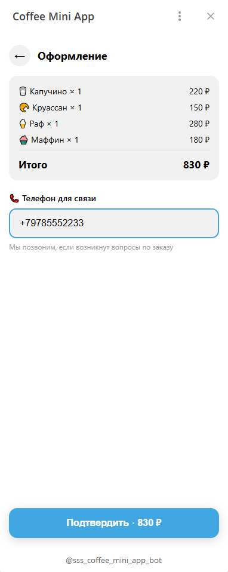
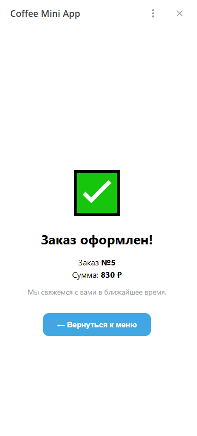
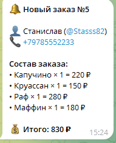

# ☕ Coffee Mini App

> Telegram Mini App для заказа кофе: меню, корзина, оформление заказа и уведомления администратору в реальном времени.


---

## 📖 О проекте

**Coffee Mini App** — полноценное Telegram Mini App (WebApp) для заказа кофе и десертов прямо внутри Telegram.

Пользователь открывает приложение из бота, выбирает напитки и десерты, оформляет заказ с указанием телефона, а владелец бизнеса мгновенно получает уведомление в Telegram.

**Кому подходит:**
- ☕ Кофейням и ресторанам — заказ без очереди
- 🍕 Пиццериям и доставке еды — приём заказов внутри Telegram
- 🛍 Небольшим магазинам — мини-каталог с оформлением
- 💼 Агентствам и фрилансерам — как готовый шаблон под клиента

---

## ✨ Возможности

### Для пользователя
- 💬 **Открывается из Telegram** — через Menu Button бота, без установки приложений
- 🎨 **Адаптивный UI** — стилизуется под тему Telegram (светлая / тёмная)
- 📂 **Категории меню** — фильтр «Всё / Кофе / Десерты»
- 🛒 **Корзина** — добавление, изменение количества, удаление
- 📝 **Оформление заказа** — имя из Telegram + телефон для связи
- ✅ **Экран успеха** — номер заказа и итоговая сумма
- 📳 **Haptic Feedback** — тактильная вибрация при действиях (на мобильных)

### Для администратора
- 🔔 **Мгновенные уведомления** — заказ приходит в Telegram сразу после оформления
- 📋 **Полная информация** — имя, username, телефон, состав, сумма
- 💾 **История заказов** — все заказы сохраняются в SQLite

### Технические
- 🔒 **Валидация initData** — HMAC-SHA256-подпись от Telegram, заказы нельзя подделать
- ⚡ **Асинхронность** — FastAPI + aiogram + React = высокая скорость
- 🎯 **Типизация** — TypeScript на фронте, Pydantic на бэке
- 🏗 **Модульная структура** — легко расширять (оплата, админка, промокоды)
- 🌐 **CORS-настройка** — корректно работает с любым доменом

---

## 📸 Скриншоты

| Меню | Корзина |
|---|---|
|  |  |

| Оформление заказа | Заказ оформлен |
|---|---|
|  |  |

**Уведомление администратору:**



---

## 🧱 Стек технологий

| Слой | Технология | Зачем |
|---|---|---|
| **Frontend** | React 19 + TypeScript | компонентный UI |
| **Сборка** | Vite 8 | быстрая сборка и dev-сервер |
| **Telegram SDK** | `telegram-web-app.js` | доступ к `initData`, темам, haptic |
| **Backend** | FastAPI | REST API + валидация |
| **Сервер** | Uvicorn | ASGI-сервер |
| **Бот** | aiogram 3.x | уведомления админу |
| **БД** | SQLite + aiosqlite | хранение заказов |
| **Авторизация** | HMAC-SHA256 | проверка подписи initData |

---

## 📁 Структура проекта

```
coffee-mini-app/
│
├── backend/                     # FastAPI + бот
│   ├── main.py                  # API-роуты, CORS, статика
│   ├── config.py                # чтение .env
│   ├── database.py              # SQLite: products, orders, order_items
│   ├── telegram_auth.py         # валидация initData
│   ├── bot.py                   # aiogram: уведомления админу
│   ├── static/                  # тестовая HTML-страница
│   ├── dist/                    # собранный React (после npm run build)
│   ├── requirements.txt
│   └── .env.example
│
├── frontend/                    # React + Vite
│   ├── src/
│   │   ├── api/                 # fetch-клиент к бэкенду
│   │   │   └── client.ts
│   │   ├── components/          # переиспользуемые компоненты
│   │   │   └── ProductCard.tsx
│   │   ├── screens/             # экраны
│   │   │   ├── MenuScreen.tsx
│   │   │   ├── CartScreen.tsx
│   │   │   ├── CheckoutScreen.tsx
│   │   │   └── SuccessScreen.tsx
│   │   ├── types/               # типы TS
│   │   │   └── index.ts
│   │   ├── App.tsx              # корневой компонент, роутинг
│   │   ├── main.tsx
│   │   ├── index.css            # все стили
│   │   └── vite-env.d.ts
│   ├── index.html               # подключает telegram-web-app.js
│   ├── package.json
│   └── vite.config.ts
│
├── screenshots/                 # PNG для README
├── .gitignore
└── README.md
```

---

## 🚀 Быстрый старт

### Предварительно

Установи:
- **Python 3.11+** — [python.org](https://www.python.org/downloads/)
- **Node.js 20+** — [nodejs.org](https://nodejs.org/)
- **ngrok** — [ngrok.com](https://ngrok.com/download) (для HTTPS-туннеля)
- **Git** — [git-scm.com](https://git-scm.com/)

### 1. Клонируй проект

```bash
git clone https://github.com/stassabadyr-wq/coffee-mini-app.git
cd coffee-mini-app
```

### 2. Настрой бэкенд

```bash
cd backend
python -m venv .venv
source .venv/bin/activate      # Windows: .venv\Scripts\Activate.ps1
pip install -r requirements.txt
```

Создай `backend/.env` (на основе `.env.example`):

```env
BOT_TOKEN=7123456789:AAH...            # от @BotFather
ADMIN_ID=1119869550                    # от @userinfobot
WEBAPP_URL=https://xxxx.ngrok-free.dev  # твой ngrok-URL
```

### 3. Настрой фронтенд

```bash
cd ../frontend
npm install
```

Создай `frontend/.env`:

```env
VITE_API_URL=https://xxxx.ngrok-free.dev
```

### 4. Собери фронтенд и скопируй в бэкенд

```bash
npm run build
cp -r dist ../backend/dist
```

На Windows PowerShell:

```powershell
npm run build
Remove-Item ..\backend\dist -Recurse -Force -ErrorAction SilentlyContinue
Copy-Item dist ..\backend\dist -Recurse
```

### 5. Запусти ngrok

В отдельном окне:

```bash
ngrok http 8000
```

Скопируй HTTPS-URL (например, `https://a1b2-34-56-78.ngrok-free.dev`) и подставь в оба `.env` (backend и frontend). **Пересобери фронтенд после изменения.**

### 6. Запусти бэкенд

```bash
cd ../backend
source .venv/bin/activate
uvicorn main:app --host 0.0.0.0 --port 8000 --reload
```

**Ожидаемо:**

```
INFO:     Uvicorn running on http://0.0.0.0:8000
✅ База данных готова
INFO:     Application startup complete.
```

### 7. Настрой бота в @BotFather

1. `/mybots` → выбери своего бота
2. **Bot Settings** → **Menu Button** → **Configure Menu Button**
3. URL: `https://xxxx.ngrok-free.dev/app`
4. Название: `☕ Заказать кофе`

### 8. Открой Mini App

В Telegram → твой бот → кнопка **☕ Заказать кофе** внизу.

---

## ⚙️ Переменные окружения

### `backend/.env`

| Ключ | Обязательно | Пример | Описание |
|---|---|---|---|
| `BOT_TOKEN` | ✅ | `7123456789:AAH...` | токен бота от [@BotFather](https://t.me/BotFather) |
| `ADMIN_ID` | ✅ | `1119869550` | Telegram ID админа ([@userinfobot](https://t.me/userinfobot)) |
| `WEBAPP_URL` | ⬜ | `https://xxxx.ngrok-free.dev` | публичный URL ngrok |

### `frontend/.env`

| Ключ | Обязательно | Пример | Описание |
|---|---|---|---|
| `VITE_API_URL` | ✅ | `https://xxxx.ngrok-free.dev` | URL бэкенда (тот же ngrok) |

⚠️ **Переменные Vite должны начинаться с `VITE_`**, иначе они не попадут в бандл.

---

## 🔒 Безопасность

### Валидация `initData`

Когда пользователь открывает Mini App из Telegram, он получает **`initData`** — строку с данными о пользователе, подписанную секретным ключом бота.

**Бэкенд проверяет подпись через HMAC-SHA256:**

```python
secret_key = hmac.new(b"WebAppData", BOT_TOKEN.encode(), hashlib.sha256).digest()
calculated_hash = hmac.new(secret_key, data_check_string.encode(), hashlib.sha256).hexdigest()

if not hmac.compare_digest(calculated_hash, received_hash):
    return None  # подпись не сходится — отказ
```

**Что это даёт:**
- ❌ Нельзя подделать заказ с чужого аккаунта
- ❌ Нельзя заказать кофе бесплатно, отправив запрос вручную
- ✅ Все заказы приходят от реальных пользователей Telegram

### Проверка цен на бэкенде

Мы **не доверяем** ценам, приходящим с фронтенда. В `main.py`:

```python
all_products = {p["id"]: p for p in get_products()}
for item in payload.items:
    product = all_products.get(item.id)
    if not product:
        raise HTTPException(status_code=400, detail=f"Товар {item.id} не найден")
    items_for_order.append({
        "id": product["id"],
        "name": product["name"],
        "price": product["price"],   # ← берём цену из БД
        "quantity": item.quantity,
    })
```

Пользователь присылает только `id` и `quantity` — цены берутся из БД.

---

## 🏗 Как это работает

### Схема взаимодействия

```
┌──────────────────┐        1. открывает       ┌─────────────────┐
│   Telegram Bot   │ ◄────── Menu Button ─────  │   Пользователь  │
│   @coffee_bot    │                            └─────────────────┘
└────────┬─────────┘                                     │
         │                                                │
         │ 2. redirect на /app                            │
         ▼                                                │
┌──────────────────┐                                     │
│     FastAPI      │ ◄──── 3. initData ──────────────────┤
│   /app /api/*    │                                     │
└────────┬─────────┘                                     │
         │                                                │
         │ 4. валидация HMAC                              │
         │ 5. создание заказа                             │
         │ 6. уведомление админу                          │
         ▼                                                │
┌──────────────────┐                                     │
│  SQLite          │                                     │
│  products/orders │                                     │
└──────────────────┘                                     │
                                                         │
         ┌───────────────────────────────────────────────┘
         │
         ▼
┌──────────────────┐
│   Уведомление    │ ────► Администратору в Telegram
└──────────────────┘
```

### Поток заказа

1. Пользователь добавляет товары в корзину (состояние в `React`)
2. Открывает экран оформления, вводит телефон
3. `POST /api/order` с `{init_data, phone, items}`
4. Бэкенд валидирует `initData` → получает данные пользователя
5. Достаёт товары из БД → создаёт заказ в `orders` и `order_items`
6. Отправляет уведомление админу через `aiogram`
7. Возвращает `{ok: true, order_id, total}`
8. Фронтенд показывает экран успеха

---

## 🗺 Roadmap

- [x] Меню с категориями
- [x] Корзина
- [x] Валидация initData
- [x] Уведомления админу
- [ ] История заказов («Мои заказы»)
- [ ] Админ-панель заказов (смена статусов)
- [ ] Оплата через Telegram Stars
- [ ] Промокоды и скидки
- [ ] Избранное
- [ ] Программа лояльности
- [ ] Docker + docker-compose
- [ ] Деплой на VPS (без ngrok)
- [ ] Мультиязычность (RU / EN)

---

## 🚀 Deployment (TODO)

Пока проект использует ngrok для разработки. Для продакшена:

1. **VPS** (Hetzner, Aeza, DigitalOcean) — €3-5/мес
2. **Домен** — например, `app.coffee-shop.ru`
3. **Nginx + Let's Encrypt** — HTTPS
4. **systemd** — автозапуск бэкенда и бота
5. **Сборка фронта на сервере** — `npm run build` после `git pull`

Подробная инструкция — в разработке.

---

## 🤝 Разработка

### Изменить меню

Открой `backend/database.py`, найди `init_db()` и отредактируй список товаров в `cur.executemany(...)`. Затем удали `coffee.db` и перезапусти бэкенд — БД пересоздастся с новым меню.

### Изменить стили

Все стили — в `frontend/src/index.css`. Используются **CSS-переменные Telegram** (`--tg-theme-bg-color`, `--tg-theme-button-color` и т.д.) — они автоматически подстраиваются под тему пользователя.

### Добавить экран

1. Создай `frontend/src/screens/MyScreen.tsx`
2. Добавь тип в `frontend/src/types/index.ts` (`type Screen = ... | 'my-screen'`)
3. Добавь условие в `frontend/src/App.tsx`

---

## 📄 Лицензия

MIT — используй свободно, в том числе в коммерческих проектах.

---

## 👤 Автор

**Станислав**  
Telegram: [@Stasss82](https://t.me/@Stasss82)  
Email: stassabadyr@gmail.com  
GitHub: [github.com/stassabadyr-wq](https://github.com/stassabadyr-wq)

---

<p align="center">
  ⭐ Если проект полезен — поставь звезду на GitHub
</p>